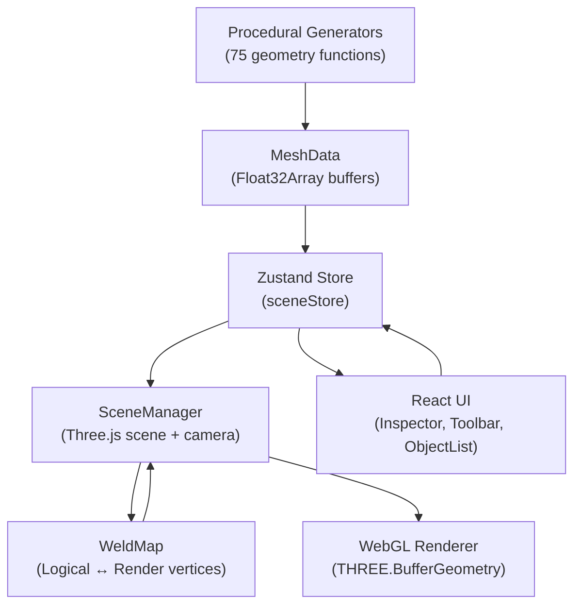

# Roowiki — Mesh Editor for Shaders & VFX

**A browser-based 2D and 3D mesh editor designed for shader development and VFX geometry workflows.**

[](https://www.typescriptlang.org/)
[](https://react.dev/)
[](https://threejs.org/)
[](https://vite.dev/)
[](LICENSE)

---

**🌐 Try it now: [roowiki.com](https://roowiki.com) — completely free, no account required.**

---

Roowiki is a focused tool for creating and inspecting the mesh data that shaders consume. Instead of opening a full DCC package to produce a simple ring, ribbon, or custom shape, you can build it in a browser, configure every vertex attribute, and export it directly to OBJ or Roowiki's native JSON format.

It is not a replacement for Blender or Maya. It is a lightweight, purpose-built tool for Technical Artists and VFX artists who need to iterate quickly on geometry used in:

- Slash effects, trails, and ribbon meshes
- Energy rings, arcs, and shockwave shapes
- Custom geometry for procedural shaders
- Masks built into vertex colors
- UV-dependent effects like scrolling textures or UV-space distortions
- Normal-mapped surfaces requiring correct tangent basis

---

## Table of Contents

- [Preview](#preview)
- [Key Features](#key-features)
- [Geometry Library](#geometry-library)
- [Mesh Editing](#mesh-editing)
- [Topology-Aware Vertex Editing](#topology-aware-vertex-editing)
- [UV Tools](#uv-tools)
- [Normals & Tangents](#normals--tangents)
- [Vertex Colors](#vertex-colors)
- [Viewport](#viewport)
- [Keyboard Shortcuts](#keyboard-shortcuts)
- [Inspector](#inspector)
- [Import / Export](#import--export)
- [Theme](#theme)
- [Example VFX Workflow](#example-vfx-workflow)
- [Why I Built Roowiki](#why-i-built-roowiki)
- [What This Project Demonstrates](#what-this-project-demonstrates)
- [Technical Overview](#technical-overview)
- [Project Structure](#project-structure)
- [Getting Started](#getting-started)
- [Roadmap](#roadmap)
- [Current Limitations](#current-limitations)
- [License](#license)
- [Author](#author)

---

## Preview


<!-- Add Object modal screenshot — shows 2D/3D primitive library with live preview -->
<!-- Vertex/Face editing screenshot — shows weld-aware sub-object transform -->
<!-- UV panel screenshot — projection types and UV Viewer -->

---

## Key Features

### Geometry Creation

- 37 procedural **2D shapes** across 6 categories, each with configurable parameters and a real-time preview
- 38 procedural **3D primitives** across 6 categories, including a dedicated VFX category
- Live vertex and triangle count in the Add Object modal
- Procedural parameters editable after placement via the Inspector

### Mesh Editing

- Three editing modes: **Object**, **Vertex**, and **Face**
- Transform gizmos (translate, rotate, scale) in all modes
- **Topology-aware vertex editing** via a WeldMap that groups render vertices by position
- Face deletion with automatic compaction of orphaned vertices
- Face normal flipping (single and multi-face)
- **Undo / Redo** with up to 50 history states

### Vertex Attributes

- **Normals** — flat or smooth, recalculated from geometry; per-vertex editing in the Inspector
- **Tangents** — computed via Gram-Schmidt orthogonalization from normals and UVs, handedness stored in W
- **Vertex Colors** — per-vertex RGBA; initialize white, initialize random, or edit each channel manually

### UV Tools

- 7 projection types: Shape Default, Planar, Disc, Radial, Cylindrical, Spherical, Box
- Seam fix via automatic vertex duplication for atan2-based projections (Cylindrical, Spherical, Radial)
- UV transforms: Scale X/Y, Offset X/Y, Rotation, Flip U, Flip V, Swap U/V
- 2D UV layout viewer in the Inspector panel
- UV Checker texture toggle in the viewport

### Viewport

- Quad view: Top, Front, Right, Perspective — all four active simultaneously
- Double-click a panel label to maximize or restore
- Per-viewport orbit, pan, and zoom controls
- Toggleable overlays: normals, tangents, vertex colors, UV checker, grid, wireframe
- Wireframe display in triangle or quad mode
- Resizable side panels

### Import / Export

- **OBJ** — import and export; preserves positions, normals, UVs
- **JSON** — Roowiki native format; preserves all attributes including tangents and vertex colors

---

## Geometry Library

### 2D Shapes — 37 total

| Category | Shapes |
|---|---|
| Curved | Circle, Ellipse, Oval, Semicircle, Arc, Ring, Sector, Segment, Crown, Crescent, Spiral |
| Triangles | Equilateral, Isosceles, Scalene, Acute, Right, Obtuse |
| Quads | Rectangle, Square, Rhombus, Rhomboid, Trapezoid, Parallelogram, Kite |
| Regular | Pentagon, Hexagon, Heptagon, Octagon, Irregular |
| Decorative | Star, Arrow, Wedge, Ribbon |
| Lines | Straight, Curved, Broken, Zigzag |

All 2D shapes generate flat geometry with proper UVs and upward-facing normals.

### 3D Primitives — 38 total

| Category | Primitives |
|---|---|
| Basic | Cube, Sphere, Cylinder, Cone, Torus, Capsule, Plane |
| Curved | UV Sphere, Icosphere, Hemisphere, Ellipsoid, Tube, Frustum, Dome |
| Prisms | Tri, Rect, Penta, Hexa, Hepta, Octa |
| Pyramids | Tetrahedron, Square, Penta, Hexa, Truncated |
| Polyhedra | Octahedron, Dodecahedron, Icosahedron, Diamond, Irregular |
| VFX | Wedge, Spike, Shard, Crystal, Ribbon, Arc, Ring, Star |

The VFX category contains shapes built specifically for effects work: thin ribbons for trails, 3D arcs for energy effects, spikes and shards for impact geometry, and 3D rings for shockwaves.

---

## Mesh Editing

Roowiki has three editing modes, switched with keyboard shortcuts `1`, `2`, `3` or the toolbar buttons.

### Object Mode

Work with entire objects: translate, rotate, scale, rename, or delete. TransformControls gizmos provide direct manipulation with immediate visual feedback. The active transform is synced to the Zustand store and persisted in object history.

### Vertex Mode

Select individual logical vertices (see [Topology-Aware Vertex Editing](#topology-aware-vertex-editing)) and apply translate, rotate, or scale transforms to the selection. The Inspector shows position, normal, UV, tangent, and color for the selected vertex, and allows direct numerical editing of position, normal, and color channels.

Multi-vertex selection via Shift+click reports the centroid of the selection in the Inspector.

### Face Mode

Select individual triangular faces. Selected faces can be transformed with the same gizmo tools as other modes. `Delete` or `Backspace` removes the selected faces and compacts the mesh: orphaned vertices are removed, the index buffer is rebuilt, and normals and tangents are cleared for recomputation.

Face normals can also be flipped individually or across a multi-face selection.

---

## Topology-Aware Vertex Editing

Meshes used in real-time rendering frequently contain **duplicated vertices** at UV seams, hard normal transitions, or attribute boundaries. A sphere, for example, typically has a seam where the UV wraps from U=1 back to U=0 — each vertex on that seam exists twice in the buffer, once for each UV value.

Naively selecting and moving one of those render vertices would split the mesh open at the seam.

Roowiki solves this with a **WeldMap**: a spatial hash structure built in O(n) time that groups render vertices by position within a tolerance of 1e-5 units.

```
Logical Vertex
├── Render Vertex A  (UV seam, side 0)
├── Render Vertex B  (UV seam, side 1)
└── Render Vertex C  (hard normal duplicate)
```

When you select or transform a logical vertex, all render vertices in its group move together. Positions are synchronized, but UV coordinates, normals, tangents, and vertex colors are kept independent — the per-attribute variation that required the duplication in the first place is preserved.

This same system is active in **Face Mode**: the face transform works from logical vertex groups as pivots, so moving a face never leaves gaps at shared edges.

---

## UV Tools

The UV panel in the Inspector controls UV projection and transformation for the selected object.

### Projection Types

| Projection | Description |
|---|---|
| Shape Default | The UV coordinates generated by the primitive itself |
| Planar | X/Z world coordinates mapped directly to U/V |
| Disc | Radial mapping from the center outward on the XZ plane |
| Radial | Polar coordinates: U = angle, V = distance from center |
| Cylindrical | atan2-based U, Y-axis V |
| Spherical | atan2-based U, acos-based V using the normal vector |
| Box | Per-face planar projection based on the dominant normal axis |

**Cylindrical**, **Spherical**, and **Radial** projections include a seam fix: triangles that cross the atan2 discontinuity at U=0/1 have their minority-side vertices automatically duplicated with a corrected U coordinate, so the GPU interpolates across a small gap rather than wrapping across the full texture.

**Radial** additionally handles the center singularity by giving each fan triangle's center vertex a unique U equal to the midpoint angle of that triangle, making radial divisions visible all the way to the origin.

### UV Transforms

After projection, the following transforms can be applied:

- **Scale X / Scale Y** — tiling
- **Offset X / Offset Y** — panning
- **Rotation** — angle in degrees, rotation around UV center (0.5, 0.5)
- **Flip U** — mirrors horizontally
- **Flip V** — mirrors vertically
- **Swap U/V** — exchanges the two channels

### UV Viewer

A 2D UV layout of the selected mesh is shown in the Inspector. The **UV Checker** button in the toolbar applies a grid texture to the mesh in the viewport, making UV stretching and seam placement immediately visible.

---

## Normals & Tangents

### Normals

Normals can be recalculated at any time:

- **Flat** — each triangle gets its geometric face normal; all three vertices in a triangle share the same value
- **Smooth** — area-weighted average of adjacent face normals per vertex, giving smooth shading across curved surfaces

Normals are also directly editable per-vertex in the Inspector when a vertex is selected in Vertex Mode.

Normal vectors can be visualized as line overlays in the viewport via the toolbar toggle.

### Tangents

Tangents are computed using the standard Gram-Schmidt orthogonalization method from positions, normals, and UVs. The result is a per-vertex `vec4` where XYZ is the tangent direction and W is the handedness (+1 or -1), matching the format expected by normal map decoders in game engines and real-time renderers.

Tangent computation requires that the mesh already has both normals and UVs. The tangent and bitangent basis vectors are shown as a separate overlay in the viewport.

Tangents are preserved across UV projection changes: when a seam-fix projection (Cylindrical, Spherical, Radial) duplicates vertices, the tangent array is extended to cover the new render vertices.

---

## Vertex Colors

Vertex colors store per-vertex RGBA data (four float32 channels) that can be consumed by any shader that reads `COLOR` or `VERTEX_COLOR` semantics.

**Initialize options:**

- **White** — sets all vertices to (1, 1, 1, 1)
- **Random** — assigns a random RGB per vertex with alpha 1.0

After initialization, each vertex's RGBA channels can be edited individually in the Inspector when that vertex is selected in Vertex Mode.

The **VColors** toggle in the toolbar renders the mesh in unlit mode using vertex color values, so the distribution is visible directly in the viewport without a custom shader.

In real-time rendering, vertex colors are useful for:

- Masks that control shader blending or effects intensity
- Baked ambient occlusion or directional data
- Gradient information for procedural effects
- Per-vertex parameters for instanced geometry

---

## Viewport

Roowiki uses a fixed quad-view layout with four synchronized cameras.

| Panel | Camera |
|---|---|
| Top-left | Top (orthographic) |
| Top-right | Perspective |
| Bottom-left | Front (orthographic) |
| Bottom-right | Right (orthographic) |

Double-clicking a panel's label maximizes it to fill the full viewport area. Double-clicking again restores the quad layout. Picking (vertex selection, face selection, object selection) adapts correctly to both fullscreen and quad modes.

**Viewport controls:**

- Left-drag — orbit (Perspective) / pan (orthographic)
- Right-drag or middle-drag — pan
- Scroll wheel — zoom
- Shift+click — add or remove from selection
- `F` — frame the selected object or vertex group in all cameras

**Overlay toggles:**

- **Grid** — reference grid
- **Normals** — normal vector line overlay
- **Tangents** — tangent and bitangent vectors
- **VColors** — unlit vertex color display
- **UV** — UV checker texture
- **Tris / Quads** — wireframe display mode

---

## Keyboard Shortcuts

| Key | Action |
|---|---|
| `Q` | Select tool |
| `W` | Move (Translate) |
| `E` | Rotate |
| `R` | Scale |
| `F` | Frame selected in all viewports |
| `1` | Object Mode |
| `2` | Vertex Mode |
| `3` | Face Mode |
| `Ctrl+Z` | Undo |
| `Ctrl+Shift+Z` | Redo |
| `Delete` / `Backspace` | Delete selected object (Object Mode) or selected faces (Face Mode) |
| `Escape` | Deselect |
| `Shift+click` | Add / remove from selection |

---

## Inspector

The right panel updates based on the current selection and editing mode.

**Transform** — position, rotation, and scale with drag-scrub numeric inputs. Labels can be dragged horizontally to adjust values without typing.

**Mesh Data** — vertex count, triangle count, and which attributes are present (normals, UVs, tangents, vertex colors) with byte sizes for each buffer.

**Vertex** (Vertex Mode, single vertex selected) — position (editable), normal (editable), UV (read-only), tangent XYZ + handedness (read-only), vertex color RGBA (editable).

**Vertex Group** (Vertex Mode, multiple vertices selected) — centroid position of the selection.

**Face** (Face Mode) — triangle index and the three vertex indices that define it.

**UV Map** — projection type, scale, offset, rotation, and flip/swap toggles.

**UV Viewer** — 2D layout of the current mesh's UV coordinates.

**Primitive Parameters** — for objects that retain their procedural source (not yet manually edited), parameters can be adjusted and the mesh is regenerated in real time.

---

## Import / Export

### Import

- **OBJ** — reads positions, normals (`vn`), and UV coordinates (`vt`). Quads and n-gons are fan-triangulated on import.
- **JSON** — Roowiki native format. Restores all attributes that were present at export time: positions, normals, UVs, tangents, vertex colors, and the index buffer.

### Export

- **OBJ** — standard Wavefront format. Face definitions include `v/vt/vn` indices when the corresponding attributes are present. Compatible with Unity, Unreal Engine, Blender, Maya, and most other tools that read OBJ.
- **JSON** — exports the full `MeshData` struct. Preserves every attribute including tangents and vertex colors, which OBJ does not support. Intended for re-importing into Roowiki or parsing in custom pipelines.

---

## Theme

Roowiki supports **dark** and **light** themes, toggled with the button in the top-right corner of the toolbar. The selected theme is persisted in `localStorage` and restored on next visit. If no stored preference exists, the system's `prefers-color-scheme` value is used as the default.

The color palette uses neutral grays designed to keep viewport overlay colors (normals in blue, tangents in green/red, selection highlights in orange) clearly readable against the UI background in both themes.

---

## Example VFX Workflow

These are examples of how Roowiki fits into a real-time graphics workflow. It does not have direct integration with Unity, Unreal, or any game engine — it produces OBJ or JSON files that you bring in manually.

**Slash / energy effect mesh:**

1. Add Object → 2D → Lines → Arc
2. Adjust inner/outer radius and segment count to get the desired sweep shape
3. Switch to Vertex Mode; pull specific vertices to break the regularity
4. UV Map → Cylindrical projection → set Offset Y for initial scroll position
5. Compute tangents for normal mapping support
6. Export → OBJ
7. Import into Unity/Unreal, attach a custom shader that reads UVs for scroll and tangents for normal map

**Stylized shockwave ring:**

1. Add Object → 3D → VFX → Ring
2. Configure outer radius, inner radius, height, and segment count
3. UV Map → Radial projection → the UV seam and center are handled automatically
4. Initialize vertex colors → White; edit the inner ring vertices to black (alpha 0)
5. The vertex color gradient serves as an opacity mask in the shader
6. Export → JSON (preserves vertex colors) or OBJ (positions + UVs only)

**Custom procedural material test plane:**

1. Add Object → 3D → Basic → Plane, high subdivision count
2. UV Map → Planar → Scale X/Y to tile
3. Compute smooth normals
4. Toggle UV Checker to verify tiling
5. Export → OBJ with normals

---

## Why I Built Roowiki

When working with shaders and real-time VFX, I kept reaching for geometry that was just slightly too specific to pull from a library: a ring with a particular inner radius, an arc that spans exactly 220 degrees, a zigzag ribbon with the UV flowing along its length.

Opening Blender for a shape that takes 30 seconds to describe is overkill. The actual problem is not modeling — it is producing specific, predictable mesh data and verifying that attributes like UVs, normals, and tangents are set up the way the shader expects.

Roowiki is the tool I wanted: a browser-based editor that handles the full attribute pipeline from primitive generation to export, without loading a DCC application or writing a script.

---

## What This Project Demonstrates

This project was built to develop and demonstrate skills in the following areas:

**Real-time 3D graphics**
Working directly with WebGL buffers through Three.js: geometry construction, attribute layout (positions, normals, UVs, tangents, vertex colors as interleaved `Float32Array` data), and the rendering pipeline from CPU data to GPU draw calls.

**Procedural geometry generation**
75 custom mesh generators written from scratch in TypeScript. Each generator constructs `Float32Array` buffers directly, computes UV coordinates analytically, and produces correct winding order and normals.

**Mesh topology**
Understanding the difference between logical and render vertices: why duplicated render vertices exist (UV seams, hard normals), how to group them spatially with a hash structure, and how to propagate position edits across the group without breaking per-attribute variation.

**UV projection and seam handling**
Seven UV projection algorithms. For atan2-based projections, the seam discontinuity requires detecting triangles that span U=0/1 and duplicating minority-side vertices with corrected coordinates. For radial projection, the center singularity requires per-triangle U assignment for the pole vertex.

**Tangent basis computation**
Gram-Schmidt orthogonalization to compute a per-vertex tangent space from positions, normals, and UVs, producing the `vec4` (xyz = tangent, w = handedness) format used in normal map shaders.

**Interaction systems**
Raycasting for object, vertex, and face selection across a quad-view layout with both fullscreen and split-panel modes. Per-panel camera management with synchronized state.

**Tool architecture**
Clean separation between the data model (`MeshData` as pure TypeScript `Float32Array` structs), global state (Zustand store), the Three.js rendering layer (`SceneManager`), and React UI components that never touch Three.js directly.

**Technical tool UX**
Drag-scrub numeric inputs, multi-mode editing, per-viewport controls, panel resizing, an undo/redo history system, and togglable debug overlays — all aimed at the workflow needs of Technical Artists rather than general users.

---

## Technical Overview

### Stack

| Layer | Technology |
|---|---|
| Framework | React 19 + TypeScript 6 |
| Build | Vite 8 |
| Rendering | Three.js v0.185 (rendering only) |
| State | Zustand v5 with `subscribeWithSelector` |
| Testing | Vitest |
| Linting | oxlint |
| Deployment | Cloudflare Workers |

### Data Model

The core data structure is a plain TypeScript interface with no Three.js dependency:

```typescript
interface MeshData {
  positions: Float32Array   // 3 floats / vertex: x, y, z
  normals?:  Float32Array   // 3 floats / vertex: nx, ny, nz
  uvs?:      Float32Array   // 2 floats / vertex: u, v
  tangents?: Float32Array   // 4 floats / vertex: tx, ty, tz, handedness
  colors?:   Float32Array   // 4 floats / vertex: r, g, b, a
  indices:   Uint32Array    // 3 indices / triangle
}
```

`SceneManager` converts `MeshData` to `THREE.BufferGeometry` at render time via `meshDataToBufferGeometry()`. React components only read from the Zustand store — they never touch Three.js.

### Architecture Diagram



### Mesh Processing Pipeline

```
Primitive Generator
      ↓
MeshData  (positions, normals, uvs, indices)
      ↓
UV Projection  (7 types + seam fix)
      ↓
Normal Recalculation  (flat or smooth)
      ↓
Tangent Computation  (Gram-Schmidt)
      ↓
Vertex Color Initialization / Editing
      ↓
GPU Geometry  (THREE.BufferGeometry)
      ↓
Viewport Render
```

---

## Project Structure

```
src/
├── core/
│   ├── MeshData.ts          Pure data interface + stats utilities
│   └── MeshObject.ts        Scene object: MeshData + transform + metadata
│
├── geometry/
│   ├── primitives/
│   │   ├── create2DShapes.ts    37 flat mesh generators
│   │   ├── createCube.ts        Per-face-normal cube
│   │   ├── createSphere.ts      UV sphere
│   │   ├── createCylinder.ts    Cylinder / cone / frustum base
│   │   ├── createTorus.ts       Torus
│   │   ├── createCapsule.ts     Capsule
│   │   ├── createPlane.ts       Subdivided plane
│   │   ├── createCurved3D.ts    UV sphere, icosphere, hemisphere, ellipsoid, tube, dome
│   │   ├── createPolyhedra3D.ts Prisms, pyramids, Platonic solids, diamond
│   │   ├── createVFX3D.ts       VFX-oriented shapes (spike, shard, crystal, ribbon, arc, ring, star)
│   │   └── registry3D.ts        Primitive registry with parameter schemas
│   ├── normals.ts           Flat and smooth normal recalculation
│   ├── tangents.ts          Gram-Schmidt tangent computation
│   ├── uvProjection.ts      7 UV projections + seam fix + transforms
│   └── faces.ts             Face deletion and normal flipping
│
├── viewport/
│   ├── SceneManager.ts      Three.js scene, cameras, controls, overlays, raycasting
│   └── MeshRenderer.ts      MeshData → THREE.BufferGeometry converter
│
├── state/
│   └── sceneStore.ts        Zustand store: objects, selection, edit mode, history
│
├── io/
│   ├── importOBJ.ts         OBJ parser with fan triangulation
│   ├── exportOBJ.ts         OBJ writer
│   ├── importJSON.ts        Roowiki JSON importer
│   └── exportJSON.ts        Roowiki JSON exporter
│
└── components/
    ├── App.tsx              Layout + global keyboard shortcuts
    ├── Viewport/            Quad-view canvas wrapper
    ├── Inspector/           Transform, mesh data, vertex, face, UV panels
    ├── ObjectList/          Scene object list with rename support
    └── Toolbar/             Mode / tool selector, Add Object modal, import button
```

---

## Getting Started

**Run locally:**

```bash
git clone https://github.com/RooWiki/shadermesh.git
cd shadermesh
npm install
npm run dev
```

Open [http://localhost:5173](http://localhost:5173).

**Build for production:**

```bash
npm run build
```

**Run tests:**

```bash
npm run test        # run once
npm run test:watch  # watch mode
```

---

## Roadmap

Features under consideration for future development:

- Additional mesh editing operations (edge loops, extrude, subdivide)
- More VFX-oriented 2D and 3D primitives
- Multi-object UV editing
- Vertex snapping
- Extended export options (glTF)
- Scene save / load (multiple objects as a single file)

Nothing listed here is committed or scheduled.

---

## Current Limitations

- **Browser-only** — there is no desktop application. All data lives in memory; closing the tab without exporting loses work.
- **No skeletal / rigged meshes** — Roowiki works with static geometry only.
- **OBJ import does not restore tangents or vertex colors** — these attributes are only preserved through Roowiki's own JSON format.
- **No multi-object operations** — transforms, UV projection, and attribute tools operate on one object at a time.

---

## License

MIT — see [LICENSE](LICENSE).

Roowiki is completely free to use.

---

## Author

Technical Artist / Tools Developer

Building tools for shaders, VFX, and real-time graphics.

**Roowiki:** [roowiki.com](https://roowiki.com)
**GitHub:** [github.com/RooWiki](https://github.com/RooWiki)

<!-- LinkedIn: [your-linkedin-url] -->
<!-- Portfolio: [your-portfolio-url] -->

---

I'm currently open to opportunities in Technical Art, VFX, real-time graphics, and tools development.
